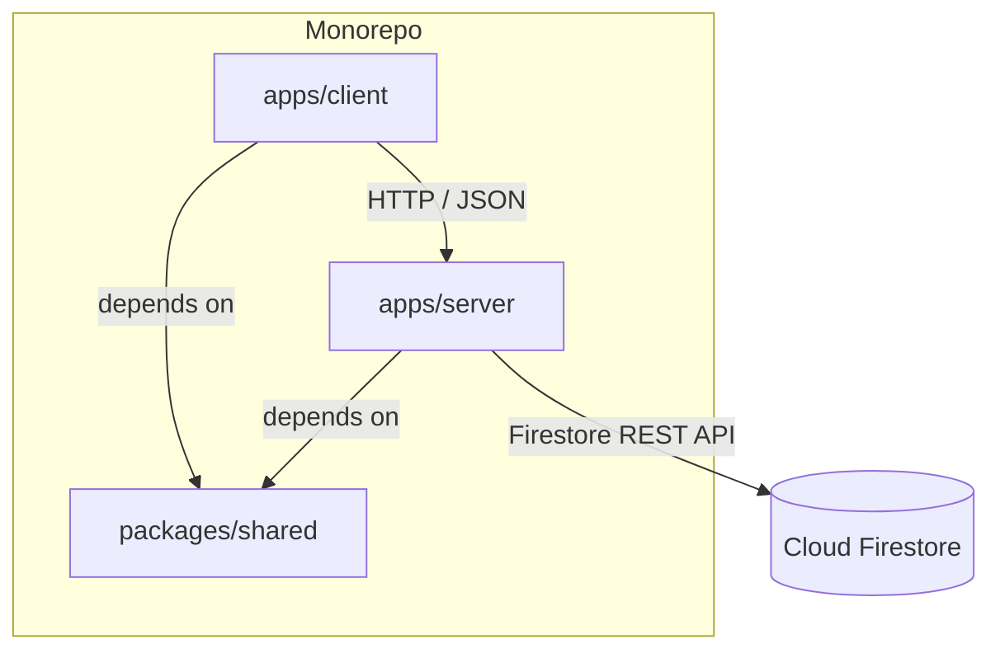
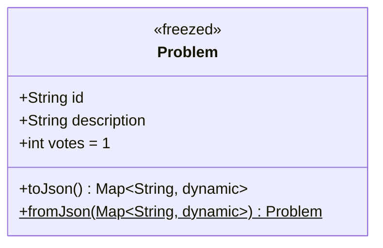
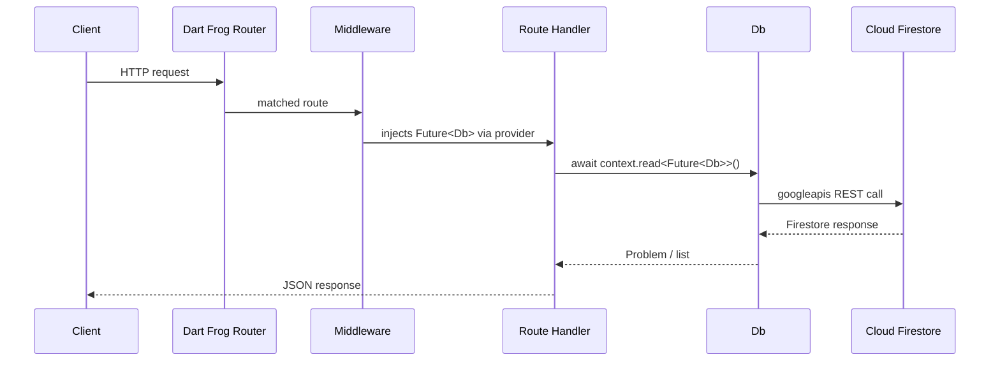
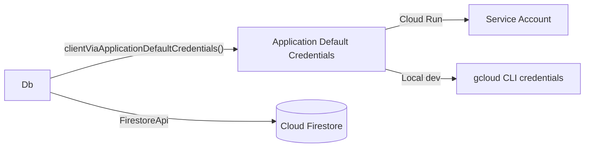
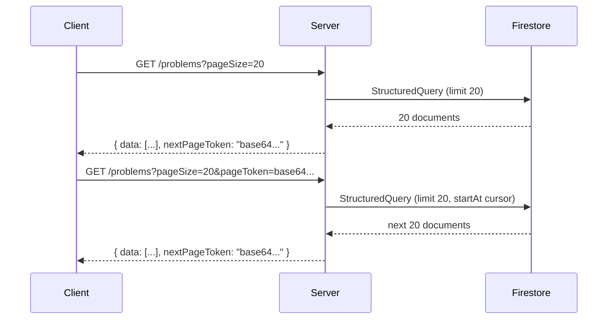
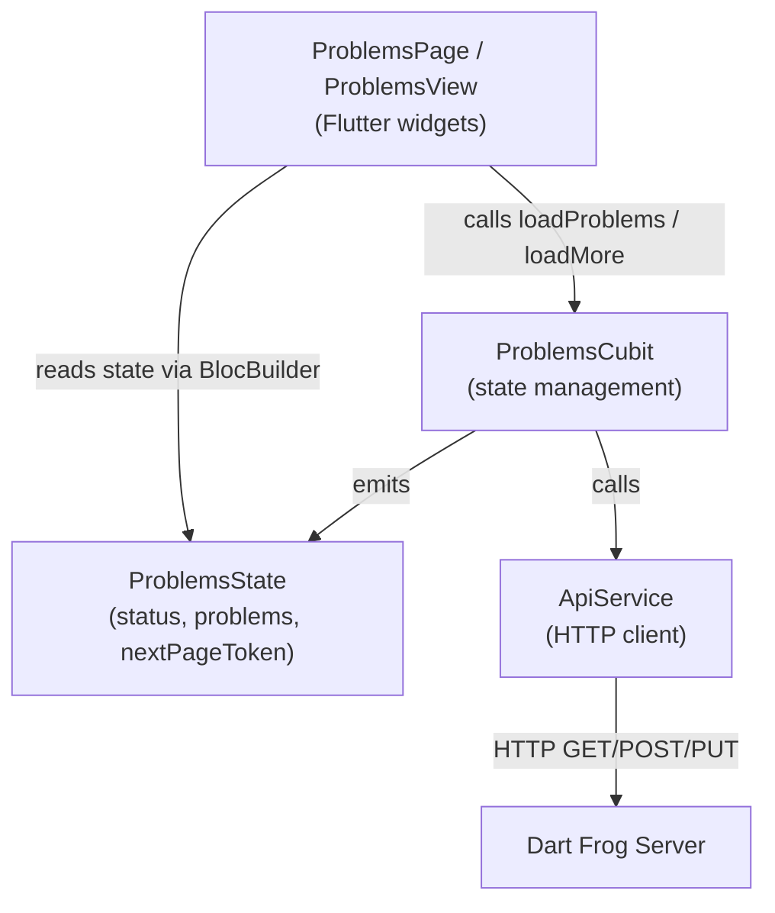
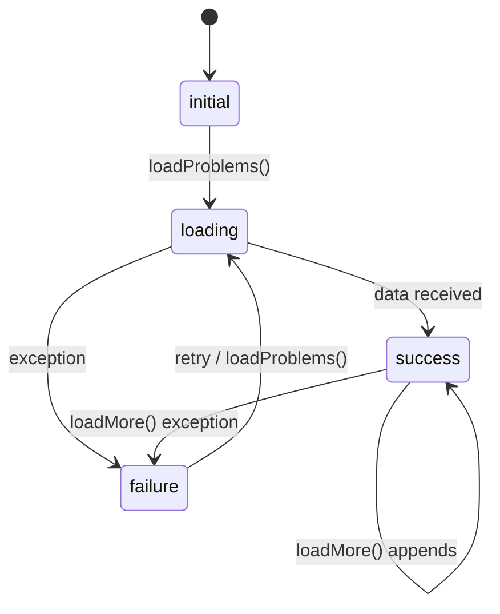
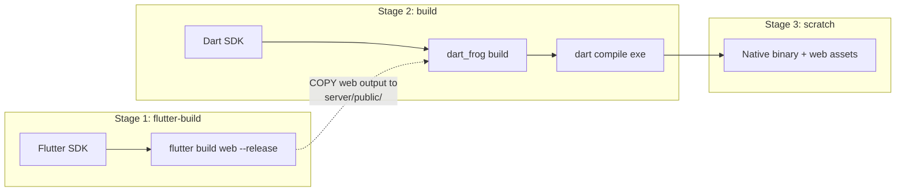
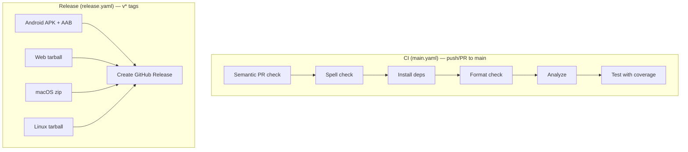

# Architecture

Votasq is a shared task queue where people vote on the priority of tasks.
It is structured as a Dart monorepo with three packages that share a single data model.

The root `pubspec.yaml` declares a Dart
[workspace](https://dart.dev/tools/pub/workspaces) containing all 3 packages.
Melos orchestrates cross-package scripts (`melos setup`, `melos gen`, etc.).

---

## Shared Package

`packages/shared` defines the data models used by both client and server.
It has no Flutter dependency and no runtime logic beyond serialization.

The core model is **Problem**:

The `@freezed` annotation generates immutability, equality, `copyWith`, and
pattern matching. `json_serializable` generates `toJson` / `fromJson`. Both
produce code in `.freezed.dart` and `.g.dart` files that must be regenerated
after model changes (`melos gen`).

---

## Server

The server is a [Dart Frog](https://dartfrog.vgv.dev) application that exposes a
REST API and serves the Flutter web client as static files.

### Request lifecycle

### File-based routing

Dart Frog maps the filesystem to routes automatically:

| File                         | Endpoint                                                    |
|------------------------------|-------------------------------------------------------------|
| `routes/index.dart`          | `GET /` — serves `public/index.html` (Flutter web build)    |
| `routes/problems/index.dart` | `GET /problems` — paginated list, `POST /problems` — create |
| `routes/problems/[id].dart`  | `GET /problems/:id` — read, `PUT /problems/:id` — update    |

Each file exports an `onRequest` function that switches on HTTP method.

### Middleware & dependency injection

`routes/_middleware.dart` provides a lazily-initialized `Future<Db>` to all
route handlers via Dart Frog's `provider<T>()`. The `Db` instance is created
once on first request and reused for the lifetime of the server process.

### Database layer (`lib/src/db.dart`)

`Db` wraps the official `googleapis` Firestore REST client.
It authenticates via Application Default Credentials — automatic on Cloud Run,
and via `gcloud auth application-default login` locally.

Key operations:

- **saveProblem** — creates or overwrites a document in the `problems` collection
- **getProblem** — fetches a single document by ID
- **getProblems** — runs a `StructuredQuery` ordered by `votes DESC, __name__ ASC`
  with cursor-based pagination

### Pagination

The server uses Firestore cursor-based pagination over a composite index
(`votes DESC`, `__name__ ASC`, defined in `firestore.indexes.json`).

The page token is a base64-encoded JSON object `{ v: votes, r: documentRef }`
representing the last item on the previous page. When `results.length < pageSize`,
no token is returned, signaling the end of the list.

### GCP project resolution (`lib/src/resolve_project_id.dart`)

1. Checks the `GOOGLE_CLOUD_PROJECT` environment variable
2. Falls back to the GCP metadata server (`metadata.google.internal`)
3. Throws if neither is available

---

## Client

The Flutter client targets iOS, Android, Web, macOS, and Windows.
It uses the BLoC pattern for state management.

### Layer diagram

### State machine

`ProblemsState` holds the current `ProblemsStatus` enum (`initial`, `loading`,
`success`, `failure`), the loaded `List<Problem>`, and an optional
`nextPageToken`. The computed getter `hasMore` drives infinite scroll —
when the user scrolls past 90% of the list, `loadMore()` fetches the next page
and appends the results.

### Flavor system

Three entry points configure the app for different environments:

| Entry point                 | Flavor      |
|-----------------------------|-------------|
| `lib/main_development.dart` | development |
| `lib/main_staging.dart`     | staging     |
| `lib/main_production.dart`  | production  |

All call `bootstrap()` which sets up BLoC observer and error logging.
`ApiService` picks its base URL at runtime: `localhost:8080` in debug mode,
the Cloud Run URL in release builds.

### Internationalization

ARB files in `lib/l10n/arb/` define localized strings (English + Spanish).
Flutter generates `AppLocalizations` at build time. Access in widgets via the
`context.l10n` extension.

---

## Build & Deployment

### Docker build (production)

The Dockerfile produces a minimal container that serves both the API and the
Flutter web client from a single binary.

1. **Stage 1** builds the Flutter web client (production flavor)
2. **Stage 2** copies the web output into `apps/server/public/`, generates the
   Dart Frog production code, and compiles it to a native executable
3. **Stage 3** copies only the binary, web assets, and runtime libs into a
   `scratch` image — the final image contains no SDK

The server's `GET /` route serves `public/index.html`, so the web client is
bundled directly into the server container.

### Cloud Run deployment

`melos deploy:server` runs `gcloud run deploy` from the repo root,
which triggers Cloud Build to execute the Dockerfile and
deploy the resulting container to Cloud Run in `us-central1`.

### CI/CD

A separate `license_check.yaml` workflow validates that all dependencies use
allowed licenses (MIT, BSD-2-Clause, BSD-3-Clause, Apache-2.0) whenever
`pubspec.yaml` files change.
