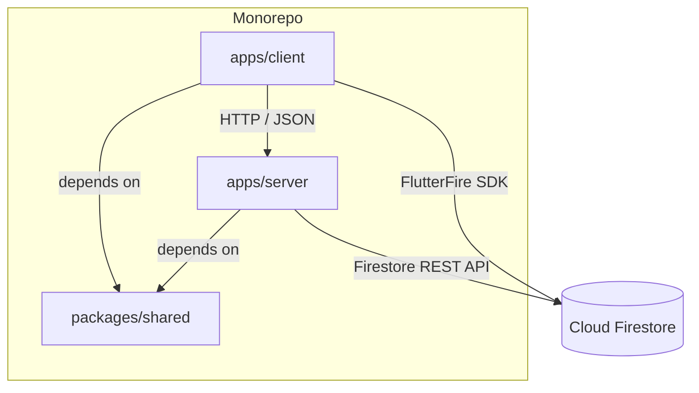
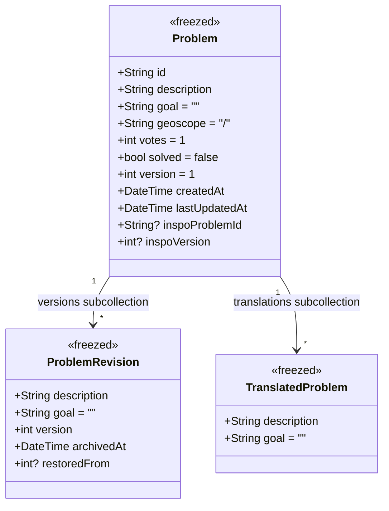
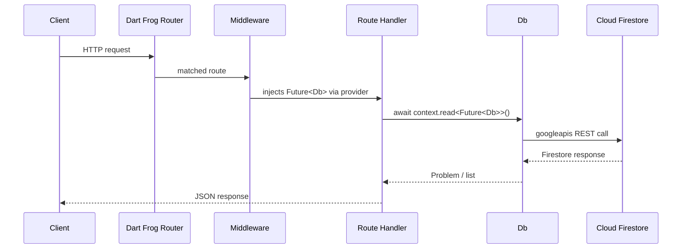
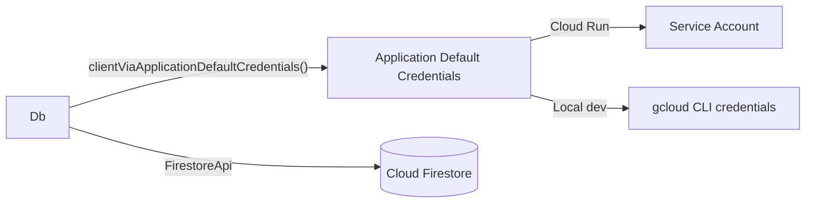
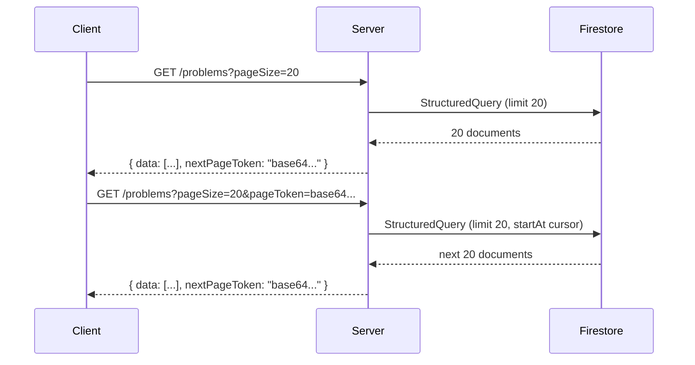
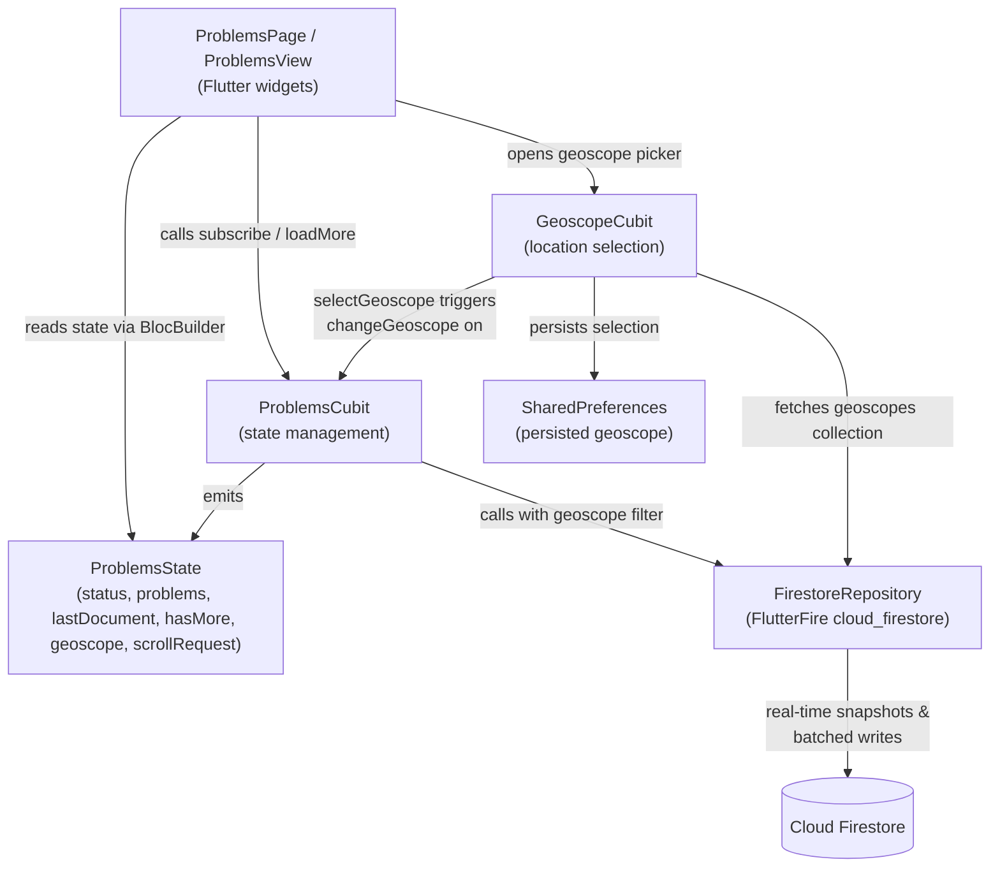
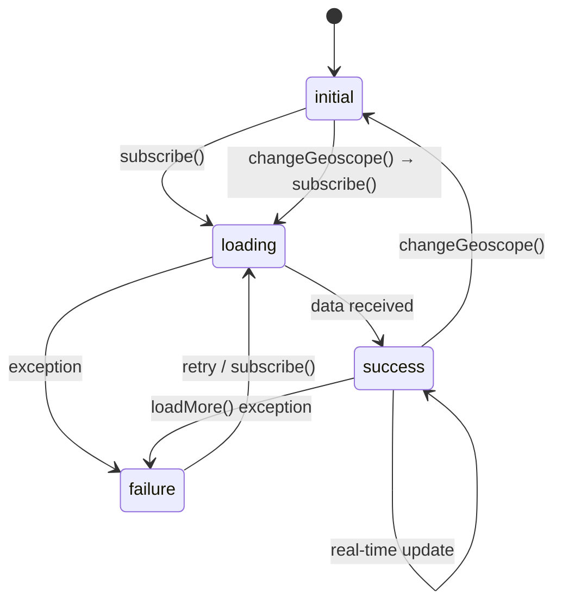
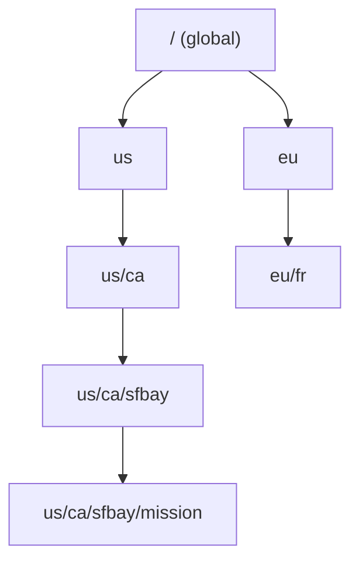
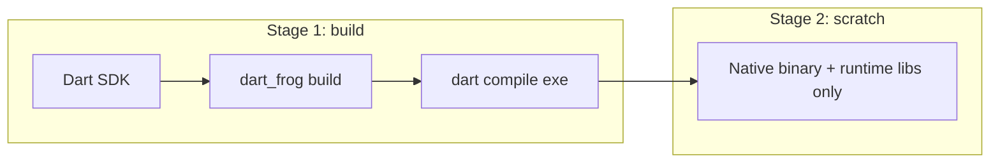
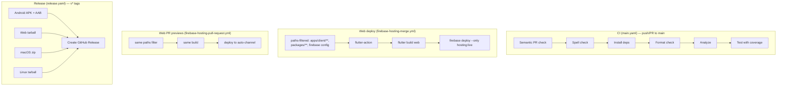

# Architecture

Votasq is a shared task queue where people vote on the priority of tasks.
It is structured as a Dart monorepo with three packages that share a single data model.

```mermaid
graph TD
    subgraph Monorepo
        shared[packages/shared]
        client[apps/client]
        server[apps/server]
    end

    client -- "depends on" --> shared
    server -- "depends on" --> shared
    client -- "HTTP / JSON" --> server
    client -- "FlutterFire SDK" --> Firestore[(Cloud Firestore)]
    server -- "Firestore REST API" --> Firestore
```

The root `pubspec.yaml` declares a Dart
[workspace](https://dart.dev/tools/pub/workspaces) containing all 3 packages.
Melos orchestrates cross-package scripts (`melos setup`, `melos gen`, etc.).

---

## Shared Package

`packages/shared` defines the data models used by both client and server.
It has no Flutter dependency and no runtime logic beyond serialization.

The core models are **Problem** and **ProblemRevision**:

```mermaid
classDiagram
    class Problem {
        <<freezed>>
        +String id
        +String description
        +String goal = ""
        +String geoscope = "/"
        +int votes = 1
        +bool solved = false
        +int version = 1
        +DateTime createdAt
        +DateTime lastUpdatedAt
        +String? inspoProblemId
        +int? inspoVersion
    }

    class ProblemRevision {
        <<freezed>>
        +String description
        +String goal = ""
        +int version
        +DateTime archivedAt
        +int? restoredFrom
    }

    class TranslatedProblem {
        <<freezed>>
        +String description
        +String goal = ""
    }

    Problem "1" --> "*" ProblemRevision : versions subcollection
    Problem "1" --> "*" TranslatedProblem : translations subcollection
```

`ProblemRevision` is an immutable snapshot of the textual fields (`description`,
`goal`) at a specific version, stored in a Firestore subcollection
(`problems/{id}/versions/{version}`). It intentionally omits mutable fields
(`votes`, `solved`) and Problem-level fields (`id`, timestamps) that are
irrelevant to the revision history.

`TranslatedProblem` caches the translation of both text fields for a given
language, stored at `problems/{id}/translations/{langCode}`.

`Problem.inspoProblemId` + `Problem.inspoVersion` together identify the
`ProblemRevision` that inspired this problem (must be set or null as a pair).
They are populated only when a user "forks" another user's problem to suggest
changes — the fork starts a fresh revision history but retains a pointer back
to the exact snapshot it was copied from. Kept as two flat fields rather than
a composite string so all forks of a given problem can be enumerated with a
direct equality query on `inspoProblemId`. Write-once: set at fork creation
and never modified afterwards (`FirestoreRepository.updateProblem` never
includes them in its update map).

The `@freezed` annotation generates immutability, equality, `copyWith`, and
pattern matching. `json_serializable` generates `toJson` / `fromJson`. Both
produce code in `.freezed.dart` and `.g.dart` files that must be regenerated
after model changes (`melos gen`).

---

## Server

The server is a [Dart Frog](https://dartfrog.vgv.dev) application that exposes a
REST API at `/api/**`. The Flutter web client is served separately by Firebase
Hosting; the Hosting site rewrites `/api/**` back to this server so the client
sees a single same-origin endpoint. See *Build & Deployment* below.

### Request lifecycle

```mermaid
sequenceDiagram
    participant C as Client
    participant R as Dart Frog Router
    participant M as Middleware
    participant H as Route Handler
    participant D as Db
    participant F as Cloud Firestore

    C->>R: HTTP request
    R->>M: matched route
    M->>H: injects Future<Db> via provider
    H->>D: await context.read<Future<Db>>()
    D->>F: googleapis REST call
    F-->>D: Firestore response
    D-->>H: Problem / list
    H-->>C: JSON response
```

### File-based routing

Dart Frog maps the filesystem to routes automatically:

| File                                            | Endpoint                                                    |
|-------------------------------------------------|-------------------------------------------------------------|
| `routes/problems/index.dart`                    | GET /problems — paginated list; POST /problems — create     |
| `routes/problems/[id]/index.dart`               | GET /problems/:id — read; PUT /problems/:id — update        |
| `routes/problems/[id]/versions/index.dart`      | GET /problems/:id/versions — version history                |
| `routes/problems/[id]/translations/[lang].dart` | GET /problems/:id/translations/:lang — cached translation   |
| `routes/translate/index.dart`                   | POST /translate — translate to English; returns lang + text |

Each file exports an `onRequest` function that switches on HTTP method.

### Middleware & dependency injection

`routes/api/_middleware.dart` provides lazily-initialized `Future<Db>` and
`Future<Translator>` to all `/api/**` route handlers via Dart Frog's
`provider<T>()`. The `Db` and `Translator` instances are created once on
first request and reused for the lifetime of the server process.

### Database layer (`lib/src/db.dart`)

`Db` wraps the official `googleapis` Firestore REST client.
It authenticates via Application Default Credentials — automatic on Cloud Run,
and via `gcloud auth application-default login` locally.

```mermaid
graph LR
    Db -->|"clientViaApplicationDefaultCredentials()"| ADC[Application Default Credentials]
    ADC -->|Cloud Run| SA[Service Account]
    ADC -->|Local dev| GCloud["gcloud CLI credentials"]
    Db -->|"FirestoreApi"| Firestore[(Cloud Firestore)]
```

Key operations:

- **saveProblem** — atomically writes the main `problems/{id}` document and a
  `ProblemRevision` to the `problems/{id}/versions/{version}` subcollection
  using a Firestore `commit` (atomic batched write). Every create or update
  produces a new revision entry, providing an audit trail of text changes.
- **getProblem** — fetches a single document by ID
- **getProblems** — runs a `StructuredQuery` ordered by `votes DESC,
  lastUpdatedAt DESC, __name__ ASC` with cursor-based pagination. Accepts an
  optional `geoscope` parameter; when
  provided, builds an ancestor-inclusive filter (OR of equality checks on the
  geoscope and all its parent levels) so that country-level and global problems
  appear alongside city-scoped results
- **getVersions** — queries the `versions` subcollection for a given problem,
  ordered by `version ASC`

### Pagination

The server uses Firestore cursor-based pagination over a composite index
(`votes DESC`, `lastUpdatedAt DESC`, `__name__ ASC`, defined in
`firestore.indexes.json`).

```mermaid
sequenceDiagram
    participant C as Client
    participant S as Server
    participant F as Firestore

    C->>S: GET /problems?pageSize=20
    S->>F: StructuredQuery (limit 20)
    F-->>S: 20 documents
    S-->>C: { data: [...], nextPageToken: "base64..." }

    C->>S: GET /problems?pageSize=20&pageToken=base64...
    S->>F: StructuredQuery (limit 20, startAt cursor)
    F-->>S: next 20 documents
    S-->>C: { data: [...], nextPageToken: "base64..." }
```

The page token is a base64-encoded JSON object
`{ v: votes, u: lastUpdatedAt, r: documentRef }` representing the last item on
the previous page (one value per `orderBy` field, so the `startAt` cursor
resumes exactly). When `results.length < pageSize`, no token is returned,
signaling the end of the list.

### GCP project resolution (`lib/src/resolve_project_id.dart`)

1. Checks the `GOOGLE_CLOUD_PROJECT` environment variable
2. Falls back to the GCP metadata server (`metadata.google.internal`)
3. Throws if neither is available

---

## Client

The Flutter client targets iOS, Android, Web, macOS, and Windows.
It uses the BLoC pattern for state management.

### Layer diagram

```mermaid
graph TD
    UI["ProblemsPage / ProblemsView<br/>(Flutter widgets)"]
    Cubit["ProblemsCubit<br/>(state management)"]
    GeoCubit["GeoscopeCubit<br/>(location selection)"]
    State["ProblemsState<br/>(status, problems, lastDocument, hasMore, geoscope, scrollRequest)"]
    Repo["FirestoreRepository<br/>(FlutterFire cloud_firestore)"]
    Prefs["SharedPreferences<br/>(persisted geoscope)"]
    Firestore[(Cloud Firestore)]

    UI -->|"reads state via BlocBuilder"| State
    UI -->|"calls subscribe / loadMore"| Cubit
    UI -->|"opens geoscope picker"| GeoCubit
    GeoCubit -->|"selectGeoscope triggers<br/>changeGeoscope on"| Cubit
    GeoCubit -->|"persists selection"| Prefs
    GeoCubit -->|"fetches geoscopes collection"| Repo
    Cubit -->|"emits"| State
    Cubit -->|"calls with geoscope filter"| Repo
    Repo -->|"real-time snapshots &<br/>batched writes"| Firestore
```

### State machine

```mermaid
stateDiagram-v2
    [*] --> initial
    initial --> loading : subscribe()
    loading --> success : data received
    loading --> failure : exception
    success --> success : loadMore() appends
    success --> success : real-time update
    success --> failure : loadMore() exception
    success --> initial : changeGeoscope()
    failure --> loading : retry / subscribe()
    initial --> loading : changeGeoscope() → subscribe()
```

`ProblemsState` holds the current `ProblemsStatus` enum (`initial`, `loading`,
`success`, `failure`), the loaded `List<Problem>`, an optional
`lastDocument` (for cursor-based pagination), a `hasMore` flag, the
current `geoscope` filter string, and an optional `scrollRequest` (a one-shot
signal asking the view to bring a problem into view). When the user scrolls
near the end of the list, `loadMore()` fetches the next page. When the user
changes geoscope, `changeGeoscope()` resets the state and re-subscribes with
the new filter.

**List reconciliation.** The watch stream covers only the first page (top
`votes`), so the cubit *merges* each snapshot into the existing list rather
than replacing it: the window is authoritative for its prefix, the paginated
tail below it is preserved, and items that left the listing (solved / hidden /
deleted) are dropped. Problem votes only ever increment, so a local optimistic
upvote is never clobbered by an in-flight snapshot that predates it.

**Eager tail-load.** Because new problems are created with `votes: 1` they sort
to the bottom of the listing (the "1-vote tier"). After the first snapshot the
cubit pages in the background until that tier is loaded, a cap of 99 problems
is reached, or the server runs out — so a freshly created problem can be
scrolled to immediately. Beyond the cap the user can still page by scrolling.

**Scroll-to (`scrollable_positioned_list`).** Creating a problem inserts it at
its honest sorted position (top of the 1-vote tier) and emits a `scrollRequest`
so the view scrolls it into view; voting optimistically increments and re-sorts
so the problem climbs, then emits a `scrollRequest` so the view keeps it visible
(gently — it only scrolls if the problem would otherwise leave the viewport).
This replaces the old behaviour where new problems were prepended to the top and
appeared to "jump down" on their first vote.

### Geoscope (location scoping)

Problems are scoped by geography via a `geoscope` field — a slash-delimited
hierarchical string (e.g. `"us/ny/nyc"`, `"eu/fr/paris"`, `"/"` for global).
The hierarchy supports up to 5 levels: root (global), superstate, state, metro,
town/neighborhood.

```mermaid
graph TD
    Root["/  (global)"]
    Root --> USA["us"]
    Root --> EU["eu"]
    USA --> CA["us/ca"]
    CA --> SF["us/ca/sfbay"]
    SF --> Mission["us/ca/sfbay/mission"]
    EU --> France["eu/fr"]
```

Queries are **ancestor-inclusive**: viewing `"us/ny/nyc"` uses a Firestore
`whereIn` filter on `['/', 'us', 'us/ny', 'us/ny/nyc']` so that country-level
and global problems appear alongside city-scoped ones.

Available geoscopes are stored in a Firestore `geoscopes` collection (each
document has `id`, `label`, and `population` fields). The `GeoscopeCubit`
manages selection and persists the user's choice in `SharedPreferences`.

**First-launch flow.** When no value is stored in `SharedPreferences`,
`initialize()` infers a default from the device locale but does **not** persist
it, and emits `needsSelection: true`. `ProblemsPage` listens for this transition
and auto-opens the `showGeoscopePicker` bottom sheet so the user makes an
explicit choice. Only `selectGeoscope` (an explicit pick — including "Global")
writes to `SharedPreferences`, so the absence of a stored value remains the
signal for "user hasn't picked yet." If the user dismisses the sheet without
picking, the picker re-opens on the next cold start. `acknowledgeSelectionPrompt`
clears the flag for the current session so the sheet doesn't re-trigger on
subsequent rebuilds.

If a persisted value becomes stale (e.g. after a hierarchy migration like
`us` → `na/us`), `initialize()` falls back via suffix matching against
available geoscopes and writes the migrated id back — this is a real prior
selection expressed under a stale id, so it bypasses the first-launch prompt.

### Language detection & translation

The client detects the language of both text fields (`description` and `goal`)
at write time and stores a single `lang` code on each Problem. Both fields must
be in the same language — cross-field validation rejects mismatches with a
`LanguageMismatchException` that surfaces as a toast in the UI.

At read time, `ProblemTranslation` compares `lang` to the user's locale to
decide whether to show a translate icon. Individual fields are rendered by
`TranslatedField` widgets that read translation state from the nearest
`ProblemTranslation` ancestor.

Both detection and translation use platform-specific implementations selected
via Dart conditional imports:

**Detection:**

- iOS / Android — ML Kit (google\_mlkit\_language\_id)
- Web (Chrome 138+) — Chrome LanguageDetector API, trigram fallback
- Web (other) / Desktop — Trigram detector

**Translation (on-device):**

- iOS / Android — ML Kit (google\_mlkit\_translation)
- Web (Chrome 138+) — Chrome Translator API
- Web (other) / Desktop — not available (falls through to cached server translation)

**Server fallback — translate instead of detect:**

When on-device detection fails, the client calls `POST /translate` which
translates the text to English via Cloud Translate. This costs the same as pure
detection but returns both the detected source language and a usable English
translation. The client caches the English translation in Firestore so it is
available to other users immediately.

**Translation caching:**

Translations (both `description` and `goal`) are cached in a Firestore
subcollection at `problems/{id}/translations/{langCode}` as `TranslatedProblem`
objects. The translation flow is:

1. Check Firestore cache (direct client read)
2. Try on-device translation (ML Kit / Chrome API) — if successful, the result
   is written to the cache so other clients benefit
3. Fall back to `GET /problems/{id}/translations/{lang}` — the server checks the
   cache, translates both fields via Cloud Translate on miss, caches, and returns

When a problem's `description` or `goal` is modified, all cached translations
are deleted (both client `updateProblem` and server `PUT /problems/{id}`).

> **Desktop ML Kit constraint:** The `google_mlkit_language_id` and
> `google_mlkit_translation` packages register Flutter method channels even on
> platforms they don't support. On macOS this interferes with the text input
> method channel, breaking `TextField` editing. To prevent this, **the ML Kit
> import chain must stay in the service/repository layer** — view and widget
> files must never import `language_detection_service.dart` or
> `translation_repository.dart` directly. `FirestoreRepository` owns the
> `LanguageDetectionService` instance so views can trigger detection without
> importing ML Kit transitively.

### Flavor system

Three entry points configure the app for different environments:

| Entry point                 | Flavor      |
|-----------------------------|-------------|
| `lib/main_development.dart` | development |
| `lib/main_staging.dart`     | staging     |
| `lib/main_production.dart`  | production  |

All call `bootstrap()` which sets up BLoC observer and error logging.
`ApiService` picks its base URL at runtime: `localhost:8080` in debug mode,
the Cloud Run URL in native release builds (iOS / Android / macOS), and an
empty string (i.e., relative URLs) in web release builds — which resolve to
`<hosting-origin>/api/**` and get rewritten to Cloud Run by Firebase Hosting.

### Internationalization

ARB files in `lib/l10n/arb/` define localized strings for 23 languages.
Flutter generates `AppLocalizations` at build time. Access in widgets via the
`context.l10n` extension.

Relative timestamps ("9 hours ago") are rendered by the `RelativeTimestamp`
widget (`lib/widgets/relative_timestamp.dart`) using the `timeago` package.
`bootstrap()` calls `registerTimeagoLocales()` once at startup to register
messages for every supported locale, keyed by `languageCode`. `timeago` bundles
most of them; Marathi, Punjabi, Swahili, and Telugu have hand-written
`LookupMessages` in `lib/l10n/timeago_locales.dart`. **Adding a new app locale
means adding it there too** — an unregistered locale silently falls back to
English.

### App Check

The client talks to Firestore both directly (via `cloud_firestore` —
`FirestoreRepository`, `FeedbackRepository`) and indirectly (via the Dart Frog
server). Firebase App Check protects only the *direct* path: `bootstrap()`
calls `FirebaseAppCheck.instance.activate(...)` after `Firebase.initializeApp`,
attaching attestation tokens to every subsequent Firestore, Auth, Functions,
and Storage call. Providers per platform: `ReCaptchaV3Provider` on web,
`AndroidPlayIntegrityProvider` / `AppleAppAttestProvider` in release builds,
debug providers otherwise. Activation is skipped when `useEmulators=true`
because the Firestore emulator does not check tokens.

The reCAPTCHA v3 site key is inlined in `bootstrap.dart` — it is a public
value by design (clients must read it to call `grecaptcha`). The matching
secret lives only in Firebase Console.

App Check does **not** cover the Dart Frog REST endpoints — those are an
independent origin from Firebase's perspective. Gating them would require
manually verifying the `X-Firebase-AppCheck` JWT in `apps/server/routes/api/
_middleware.dart` against Firebase's JWKS.

---

## Build & Deployment

### Docker build (production)

The Dockerfile produces a minimal API-only container. Flutter web is built
and deployed independently by a separate GitHub Actions pipeline (see
*Deploy pipelines* below).

```mermaid
graph LR
    subgraph "Stage 1: build"
        B1[Dart SDK] --> B2["dart_frog build"]
        B2 --> B3["dart compile exe"]
    end

    subgraph "Stage 2: scratch"
        C1["Native binary + runtime libs only"]
    end

    B3 --> C1
```

1. **Stage 1** copies `apps/server/`, `packages/`, and root pubspec files;
   `sed`s the Flutter client and MLKit packages out of the workspace
   (so `dart pub get` doesn't try to resolve Flutter SDK deps); runs
   `dart_frog build`; compiles to a native executable
2. **Stage 2** copies the binary + runtime libs into a `scratch` image —
   the final image contains no SDK and no `public/` directory

**Adding workspace members.** The build context copies the entire `packages/`
tree, so a new `packages/<name>/` entry needs no Dockerfile change *unless*
the new package depends on the Flutter SDK, in which case it must be
`sed`-removed from the workspace alongside the existing `apps/client/` /
`google_mlkit_*` exclusions (the build stage runs in a Dart-only image).
A new `apps/<name>/` entry needs an explicit `COPY` if it should be in the
build context; otherwise it can be left out and `sed` will skip it.

### Deploy pipelines

Two independent pipelines, one per architectural concern. Both fire from
pushes to `main` and use **path filters** so each only runs when its inputs
change.

```mermaid
graph TD
    subgraph "API: Cloud Build trigger → Cloud Run"
        A1["push to main"]
        A1 -->|"paths: apps/server/**, packages/**,<br/>Dockerfile, cloudbuild.yaml,<br/>pubspec.yaml, pubspec.lock"| A2["Cloud Build (Kaniko)"]
        A2 --> A3["Push image to<br/>Artifact Registry"]
        A3 --> A4["gcloud run services update votasq"]
    end

    subgraph "Web: GitHub Actions → Firebase Hosting"
        W1["push to main"]
        W1 -->|"paths: apps/client/**, packages/**,<br/>firebase.json, .firebaserc,<br/>workflow file itself"| W2["actions/checkout +<br/>subosito/flutter-action"]
        W2 --> W3["flutter build web --release"]
        W3 --> W4["FirebaseExtended/<br/>action-hosting-deploy"]
    end
```

**API pipeline.** The Cloud Build trigger
`rmgpgab-votasq-us-central1-adsouza-votasq--mavwk` (in `gcloud builds
triggers describe`) reads `cloudbuild.yaml` from the repo, builds the
Dockerfile via Kaniko with per-layer registry cache
(`--cache=true --cache-ttl=24h`), pushes to
`us-central1-docker.pkg.dev/votasq/cloud-run-source-deploy/votasq/votasq:<sha>`,
and deploys the new revision to the `votasq` Cloud Run service in
`us-central1`. `melos deploy:server` is a manual fallback for the same
endpoint, useful when the trigger is down or for testing uncommitted code.

**Web pipeline.** `.github/workflows/firebase-hosting-merge.yml` runs
`flutter build web --release --target lib/main_production.dart
--dart-define=SERVER_URL=` (empty `SERVER_URL` → relative API URLs → same-
origin via the Hosting rewrite) and deploys the build to the `votasqueue`
Firebase Hosting site via a least-privileged
`Firebase Hosting Admin` service account (key stored in the GitHub repo
secret `FIREBASE_SERVICE_ACCOUNT_VOTASQ`). PRs trigger a sibling workflow
that deploys to an auto-expiring preview channel.

### Domains & traffic routing

The web app is served from two URLs:

- **`votasqueue.web.app`** — the project's Firebase Hosting site URL.
  Always available. Auto-provisioned cert. HSTS-preloaded by the `.web.app`
  zone, so browsers never accept HTTP traffic here.
- **`votasq.quikchange.net`** — custom domain. DNS is a CNAME to
  `votasqueue.web.app`; Firebase Hosting issued a Google Trust Services
  managed cert after the domain was added in Console.

Both URLs serve identical content from Firebase Hosting's global CDN.
Requests under `/api/**` are rewritten (per the `hosting.rewrites` block in
root `firebase.json`) to the `votasq` Cloud Run service, so client code can
make plain relative `/api/...` calls without any cross-origin concerns.

Hitting Cloud Run directly (`https://votasq-269624680910.us-central1.run.app/`)
returns 404 for non-`/api/` paths — Cloud Run is exclusively an API server.

### CI/CD

```mermaid
graph TD
    subgraph "CI (main.yaml) — push/PR to main"
        CI1[Semantic PR check] --> CI2[Spell check]
        CI2 --> CI3[Install deps]
        CI3 --> CI4[Format check]
        CI4 --> CI5[Analyze]
        CI5 --> CI6[Test with coverage]
    end

    subgraph "Web deploy (firebase-hosting-merge.yml)"
        WD1["paths-filtered: apps/client/**,<br/>packages/**, firebase config"] --> WD2[flutter-action] --> WD3[flutter build web] --> WD4[firebase deploy --only hosting:live]
    end

    subgraph "Web PR previews (firebase-hosting-pull-request.yml)"
        PR1[same paths filter] --> PR2[same build] --> PR3[deploy to auto-channel]
    end

    subgraph "Release (release.yaml) — v* tags"
        R1[Android APK + AAB]
        R2[Web tarball]
        R3[macOS zip]
        R4[Linux tarball]
        R1 & R2 & R3 & R4 --> R5[Create GitHub Release]
    end
```

A separate `license_check.yaml` workflow validates that all dependencies use
allowed licenses (MIT, BSD-2-Clause, BSD-3-Clause, Apache-2.0) whenever
`pubspec.yaml` files change.

The release workflow (`release.yaml`) is **independent** of the routine
deploy pipelines above — it builds and publishes mobile + desktop artifacts
on `v*` tag pushes, not on every commit. The web tarball it produces is for
ad-hoc distribution; routine web deploys go through the Hosting workflow.
